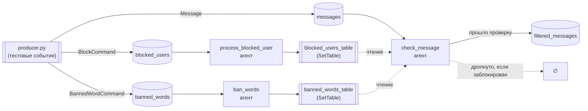

# 📨 Модерация сообщений на Faust

> Потоковая система обработки сообщений с блокировкой пользователей и цензурой слов, на **Faust** (Python-аналог Kafka Streams) и **Apache Kafka**.

`Python` · `Faust-streaming` · `Apache Kafka (KRaft)` · `Docker Compose` · `uv`

---

## 📑 Содержание

- [[#💡 Идея]]
- [[#🧱 Архитектура]]
- [[#🗂️ Топики Kafka]]
- [[#📦 Модели данных]]
- [[#🗄️ Persistent state]]
- [[#⚙️ Агенты]]
- [[#🚀 Запуск]]
- [[#🧪 Тестирование]]
- [[#⚠️ Известные ограничения]]
- [[#🔗 Полезные ссылки]]

---

## 💡 Идея

Система решает две задачи модерации:

- 🚫 **блокировка пользователей** — сообщения от заблокированного отправителя не доходят до получателя;
- 🧼 **цензура слов** — запрещённые слова маскируются звёздочками перед отправкой получателю.

> [!info] Потоковая обработка vs пакетная
> Здесь всё построено на **потоковой обработке**: каждое сообщение из Kafka обрабатывается сразу, по мере поступления, отдельным Faust-агентом — без ожидания, пока накопится пачка данных. Это принципиально отличается от **пакетной (batch) обработки**, где данные сначала собираются целиком (файл, выгрузка, диапазон времени), а затем один раз прогоняются через обработку. Persistent-состояние (списки блокировок и список запрещённых слов) хранится в Faust `Table`, которая реплицируется в собственный changelog-топик Kafka и переживает перезапуск приложения — состояние не теряется.

---

## 🧱 Архитектура

```
faust-project/
├── docker-compose.yml     # Kafka (KRaft), kafka-ui, kafka-init, ksqldb (задание 2)
└── app/
    ├── app.py             # faust.App — точка входа для `faust worker`
    ├── config.py          # адрес брокера, имена топиков, APP_ID
    ├── models.py          # faust.Record: Message, BlockCommand, BannedWordCommand
    ├── tables.py          # persistent state: blocked_users_table, banned_words_table
    ├── agents.py          # потоковые обработчики (Faust agents)
    └── producer.py        # тестовый продюсер (@app.command)
```

Поток данных целиком:



---

## 🗂️ Топики Kafka

| Топик | Назначение |
|---|---|
| `messages` | входящие сообщения от пользователей |
| `filtered_messages` | сообщения после фильтрации блокировок и цензуры слов |
| `blocked_users` | события блокировки/разблокировки пользователей |
| `banned_words` | события добавления/удаления запрещённых слов |

---

## 📦 Модели данных

Faust `Record` — аналог Pydantic-схем со встроенной JSON-сериализацией. Все три описаны в `models.py`.

**`Message`** — сообщение пользователя.
`user_id`, `recipient_id`, `message`, `timestamp`. Летает в `messages` и `filtered_messages`.

**`BlockCommand`** — событие блокировки.
`blocker_id` (кто блокирует), `blocked_id` (кого блокирует), `is_blocked` (`True` — заблокировать, `False` — разблокировать). Летает в `blocked_users`.

**`BannedWordCommand`** — событие изменения списка запрещённых слов.
`word`, `is_banned` (`True` — запретить, `False` — разрешить обратно). Летает в `banned_words`.

---

## 🗄️ Persistent state

**`blocked_users_table`** — `faust.SetTable`, ключ — `blocker_id`, значение — множество заблокированных им пользователей.

**`banned_words_table`** — тоже `SetTable`, с одним фиксированным ключом `"global"` (список общий для всех).

> [!warning] Почему `SetTable`, а не обычный `Table`
> Обычный `faust.Table` с `default=set` здесь не подходит. При обращении к отсутствующему ключу он через `__missing__` создаёт **временный** объект-заглушку и никогда не сохраняет его обратно в хранилище — запись в changelog происходит только через явный `__setitem__` (`table[key] = value`). Мутация через `.add()`/`.discard()` на объекте, полученном по чтению, изменяет только "выброшенную" копию — состояние молча остаётся пустым навсегда, без единой ошибки в логах. `SetTable` создан специально под этот паттерн ("словарь множеств, мутируем через `.add`/`.discard`") и корректно реплицирует изменения в changelog.

---

## ⚙️ Агенты

Все — в `agents.py`.

**`process_blocked_user`** — слушает `blocked_users`. На каждое событие добавляет/убирает пользователя из множества заблокированных.

**`ban_words`** — слушает `banned_words`. На каждое событие добавляет/убирает слово из общего списка запрещённых.

**`check_message`** — ядро модерации, слушает `messages`. Для каждого сообщения:

1. проверяет, не заблокировал ли получатель отправителя — `msg.user_id in blocked_users_table[msg.recipient_id]`; если да, сообщение молча дропается и дальше не идёт;
2. иначе разбивает текст на слова и заменяет найденные в `banned_words_table["global"]` (без учёта регистра) на `"*" * len(слово)`;
3. отправляет очищенный `Message` в `filtered_messages`.

---

## 🚀 Запуск

**1. Поднять инфраструктуру:**

```bash
docker compose up -d
```

Дождаться, пока `kafka` станет `healthy`, и `kafka-init` завершится с `exit 0` (создаёт все четыре топика).

**2. Запустить Faust-воркер** (из корня проекта, не из папки `app`):

```bash
uv run faust -A app.app worker -l info
```

Ждать строку `[Worker]: Ready`.

---

## 🧪 Тестирование

Тестовый сценарий реализован в `producer.py` как Faust-команда. Запускается в отдельном терминале, воркер должен уже работать:

```bash
uv run faust -A app.app main
```

Сценарий отправляет по порядку:

| # | Событие | Топик | Ожидаемый эффект |
|---|---|---|---|
| 1 | `BlockCommand(blocker_id="user_2", blocked_id="user_1", is_blocked=True)` | `blocked_users` | user_2 блокирует user_1 |
| 2 | `BannedWordCommand(word="урод", is_banned=True)` | `banned_words` | слово "урод" запрещено |
| — | *(пауза 2 сек — агенты успевают обновить таблицы)* | | |
| 3 | `Message(user_id="user_1", recipient_id="user_2", message="Привет", ...)` | `messages` | 🚫 отфильтровано целиком (блокировка) |
| 4 | `Message(user_id="user_3", recipient_id="user_4", message="Ты урод", ...)` | `messages` | 🧼 доходит с маской: `"Ты ****"` |
| 5 | `Message(user_id="user_3", recipient_id="user_4", message="Привет, это чистое сообщение", ...)` | `messages` | ✅ доходит без изменений |

### Проверка результата

Открыть [kafka-ui → localhost:8080](http://localhost:8080), топик `filtered_messages`. Ожидаемый результат — **два** сообщения:

```json
{"user_id": "user_3", "recipient_id": "user_4", "message": "Ты ****", ...}
{"user_id": "user_3", "recipient_id": "user_4", "message": "Привет, это чистое сообщение", ...}
```

Сообщения от `user_1` там быть не должно вообще — оно отфильтровано блокировкой.

Также можно проверить исходные топики `blocked_users` и `banned_words` — там видны отправленные события.

---

## ⚠️ Известные ограничения

> [!warning] Маскировка и пунктуация
> Разбиение текста идёт простым `str.split(" ")`, слова сравниваются целиком. Слово с пунктуацией вплотную ("урод," или "урод!") не распознаётся как совпадение. Для продакшена стоило бы использовать регулярные выражения с границами слов (`\b`), чтобы отделять пунктуацию от самого слова.

---

## 🔗 Полезные ссылки

- [Faust-streaming (форк, который реально поддерживается)](https://github.com/faust-streaming/faust)
- [Faust — документация](https://faust.readthedocs.io/en/latest/)
- [Apache Kafka Quick Start (Docker)](https://developer.confluent.io/quickstart/kafka-local/)
- [kafka-ui (provectuslabs)](https://github.com/provectus/kafka-ui)
- [ksqlDB — документация](https://docs.confluent.io/platform/current/ksqldb/index.html)
